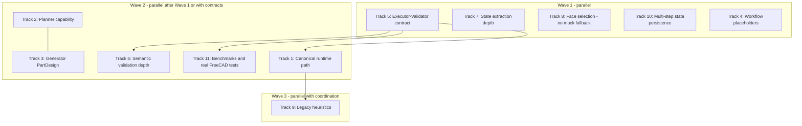

# Parallel Remediation Plan: Model Quality Core Findings

Date: 2026-04-24

This document turns each **core finding (1–11)** in [MODEL_QUALITY_ANALYSIS.md](./MODEL_QUALITY_ANALYSIS.md) into an executable track that multiple agents can run **in parallel** where safe, with explicit **coordination** where contracts or files overlap.

---

## How to use this with parallel agents

- **Assign one track per agent** (sections below). Tracks that share a **contract** or **module** should either be **one agent** or run **serially after a merge** of the contract PR.
- **Merge order for lowest conflict pain:** contract/data path first **(Track 5)**, then branches that only consume that contract **(6, 11)** and routing **(Track 1)**. Planner and generator **(Tracks 2, 3)** can run in parallel **only after** a short agreement on **plan JSON / op names** (even a stub schema in repo is enough).
- **Daily sync:** shared operation vocabulary, what “success” means for workflows (no silent mocks), and **what the validator may assume** about executor payloads.

---

## Dependency map (what can run truly in parallel)

- **Wave 1:** Tracks 5, 7, 8, 10, 4 are mostly **different subsystems**; still **coordinate** on “no fake geometry” philosophy with **8** and **4** (workflows must not claim success for mocks).
- **Wave 2:** **6** and **11** should assume **5**’s payload shape is stable (or branch from 5’s branch).
- **2 and 3:** parallel **if** they share a **single extended op vocabulary** (doc or `TypedDict`/Pydantic model) to avoid planner emitting ops the generator cannot run.

---

## Track 1 — Finding 1: Two architectures; default path is legacy

**Goal:** One **canonical** user-facing pipeline (recommend: **orchestration + agents** as default), with legacy clearly **deprecated, feature-flagged, or secondary CLI**.

**Scope (indicative):** `src/ai_designer/__main__.py`, `src/ai_designer/cli.py`, `src/ai_designer/core/orchestrator.py`, docs for entrypoints.

**Work packages**

1. Inventory every entrypoint (CLI subcommands, API routes) and which stack they call.
2. Choose **default**: e.g. “`generate` uses agent graph; legacy is `--legacy`.”
3. Implement routing + **deprecation warnings** for old path.
4. Add a **matrix doc** (short): default vs legacy behavior.

**Done when:** New users hit one primary path; legacy is opt-in; no silent divergence without docs.

### Before implementing, this agent must keep in mind

- Do **not** delete legacy until **Track 5** (metrics) works on the **canonical** path you are promoting, or you will move users onto a path that still cannot refine.
- Align on which API/CLI promises stay stable for external callers.
- Run full smoke on **both** paths until legacy is removed.

---

## Track 2 — Finding 2: Planner too primitive for complex CAD

**Goal:** Extend **plannable operations** toward PartDesign: body, sketch steps, pad/pocket/loft/sweep/shell/draft, patterns, mirror, datums—**as schema + prompt**, even if executor support lands incrementally.

**Scope:** `src/ai_designer/agents/planner.py`, align with `src/ai_designer/agents/prompts/system_prompts.py` (reuse or import the richer PartDesign prompt instead of duplicating a weaker one).

**Work packages**

1. Define **versioned** plan schema (e.g. `plan_version`, list of `steps[]` with typed `op`).
2. Expand op enum and **document** which ops are **planned-only** vs **executable today** (honesty ties to Track 4).
3. Swap planner system prompt to **one** authoritative PartDesign-oriented prompt source.
4. Unit tests: planner output parses and validates against schema for hard prompts.

**Done when:** Planner can express nontrivial feature trees on paper; invalid plans fail validation, not FreeCAD at random.

### Before implementing

- **Lock schema with Track 3** before large merges (avoid planner emitting unsupported ops without a stub policy).
- Do not promise execution for new ops until **Track 3** or FreeCAD runner supports them—use explicit `unsupported` handling if needed.

---

## Track 3 — Finding 3: Generator primitive-centric

**Goal:** Generator prompts and examples **body-first**, sketches, constraints, stable references—aligned with Track 2 schema.

**Scope:** `src/ai_designer/agents/generator.py`; optionally bridge to executor commands.

**Work packages**

1. Rewrite generator system prompt and few-shots toward **PartDesign / Sketcher** patterns.
2. Map each planner op to **concrete FreeCAD script shape** (or mark `NotImplemented` with clear error).
3. Extend tests beyond box/cylinder/cut.

**Done when:** For a defined subset of new ops, end-to-end script generation is consistent with planner.

### Before implementing

- Consume the **same schema** as Track 2; avoid a second ad-hoc JSON shape.
- Prefer **incremental** op support (implement 2–3 features well) over listing many ops with thin stubs.

---

## Track 4 — Finding 4: Workflow orchestrator mocks / placeholders

**Goal:** **No silent success** for unsupported steps; either **real FreeCAD execution** or **explicit failure** + capability flags.

**Scope:** `src/ai_designer/freecad/workflow_orchestrator.py` (unsupported step handling; hole/pattern/fillet/chamfer mocks; housing/assembly placeholders).

**Work packages**

1. Replace “mock success” with structured result: `status: skipped_unimplemented` or `failed` + reason, surfaced to caller.
2. Implement **one** vertical slice (e.g. **holes** OR **patterns**) for real; leave others explicitly unimplemented.
3. API/docs: list **actually supported** workflow steps.

**Done when:** Callers never get “success” with zero geometry change unless the step is explicitly no-op by design.

### Before implementing

- Coordinate with **Track 1**: if workflows are legacy-only, consider **gating** fixes behind the same flag or documenting deprecation.
- Align error shape with **Track 5** so validators/orchestration can react.

---

## Track 5 — Finding 5: Validator vs executor structural mismatch (highest leverage)

**Goal:** **Single contract**: executor → orchestration nodes → validator receives **geometry metrics** (`object_count`, `total_volume`, `bounding_box`, manifold flags, etc.) or explicit `null` with reason.

**Scope:** `src/ai_designer/orchestration/nodes.py`, `src/ai_designer/agents/executor.py`, `src/ai_designer/agents/validator.py`, and wherever state is produced (`state_extractor` / headless runner) to **populate** metrics.

**Work packages**

1. Define **Pydantic/TypedDict** for `ExecutionFeedback` / `GeometrySummary` used end-to-end.
2. Extend `FreeCADExecutor.execute()` (and FreeCAD subprocess output if needed) to fill metrics.
3. Stop stripping fields in nodes; pass full payload to validator.
4. Tests: validator receives nonzero volume on a known script.

**Done when:** Validator no longer relies on zero defaults for successful runs on golden scripts.

### Before implementing

- This track is **foundational**; prefer a **small PR first** that only adds fields + backward-compatible defaults, then tighten validator logic in a follow-up.
- Coordinate with **Track 7**: some metrics may naturally come from extended state extraction.

---

## Track 6 — Finding 6: Semantic validation too shallow (keyword tokens)

**Goal:** Move from string token matching toward **structured checks**: dimensions vs spec, feature presence, ordering sanity—using **real metrics** from Track 5 and richer state from Track 7 where possible.

**Scope:** `src/ai_designer/agents/validator.py` (semantic validation section).

**Work packages**

1. Parse **user intent** into a small structured spec (dims, features)—could be planner output or a dedicated extraction step.
2. Compare spec to **state/metrics**, not only script text.
3. Keep keyword checks only as **fallback** with low weight.

**Done when:** Obvious wrong dimensions / missing features fail validation even if script mentions `"Box"`.

### Before implementing

- **Depends on Track 5** payload; optionally **Track 7** for deeper checks.
- Avoid false confidence: if data is missing, return **“unknown”** not “pass”.

---

## Track 7 — Finding 7: State extraction too shallow

**Goal:** Richer, **machine-usable** state: topology hints, DOF/underconstraint signals, key measurements, recompute errors with context—incrementally.

**Scope:** `src/ai_designer/freecad/state_extractor.py`.

**Work packages**

1. Prioritize one upgrade (e.g. **per-face area / center of mass / volume**—extend to **edge/vertex counts**, **named references**).
2. Sketcher: export constraint list summary, not only counts.
3. Define stable JSON keys so **Track 6** and **Track 5** can consume without ad hoc parsing.

**Done when:** Validator/refinement can cite structured state in decisions.

### Before implementing

- Performance: heavy topology can be **optional** `detail_level`.
- Same **schema discipline** as Track 5—version fields if needed.

---

## Track 8 — Finding 8: Face selection mock fallback

**Goal:** **Never** return fake face data as if real; fail loud or return empty + error code.

**Scope:** `src/ai_designer/freecad/face_selection_engine.py` (mock return sites on parse failure / no faces).

**Work packages**

1. Replace mock faces with explicit `FaceSelectionError` / result type `success: false`.
2. Propagate errors to workflow / generator so UI or logs show failure.
3. Tests for “bad input → no fake faces”.

**Done when:** No code path fabricates plausible-but-false face records silently.

### Before implementing

- **Breaking change** for callers that assumed success: update **Track 4** workflows and any generator that assumes faces always exist.
- Pair with **Track 11** for regression tests.

---

## Track 9 — Finding 9: Legacy keyword heuristics

**Goal:** Reduce harm of regex/keyword routing: either **narrow scope** of legacy path, delegate to LLM/planner for ambiguous cases, or add structured intent from the **canonical** path only.

**Scope:** `src/ai_designer/core/intent_processor.py`, `src/ai_designer/freecad/workflow_templates.py`, `src/ai_designer/freecad/geometry_helpers.py`.

**Work packages**

1. Document what legacy path is **still responsible** for after Track 1.
2. Replace brittle paths with “unknown → escalate to planner” where possible.
3. Extend `analyze_geometry_requirements()` only where legacy must remain for compatibility.

**Done when:** Complex prompts are less often collapsed to wrong primitive templates—or legacy is clearly unsupported.

### Before implementing

- **Coordinate with Track 1:** if legacy is deprecated, cap effort—focus on **safety** (no wrong workflow) over feature growth.
- Do not duplicate **Track 2** logic in regex form; prefer delegation.

---

## Track 10 — Finding 10: Multi-step subprocess state not persisted

**Goal:** Subprocess mode either **persists document between steps** (same doc path + reload) or **one merged script** per workflow; document which is guaranteed.

**Scope:** `src/ai_designer/freecad/state_aware_processor.py`, interaction with headless runner / CLI.

**Work packages**

1. Reproduce with minimal multi-step scenario; pick strategy (persist vs merge).
2. Implement + test: step N sees objects from step N−1.
3. Expose invariant in docstring and user-facing error if invariant cannot be met.

**Done when:** Multi-step workflows produce the same final `.FCStd` as equivalent single process run (within defined scope).

### Before implementing

- Understand **FreeCAD headless** process lifecycle (who spawns whom).
- Align with **Track 5**: final state must be visible to metrics extraction.

---

## Track 11 — Finding 11: Tests mocked; weak evidence on complex CAD

**Goal:** **Tiered tests:** fast mocked unit tests + **optional/slow** job with **real FreeCAD** + small **benchmark corpus** (simple / medium / hard prompts).

**Scope:** `tests/conftest.py`, new benchmark directory, `tests/fixtures/sample_scripts.py`, CI config.

**Work packages**

1. Add `pytest` marker (e.g. `@pytest.mark.freecad`) and CI job (or local-only documented command).
2. Curate **10–30 prompts** with **pass criteria** (volume range, bbox, feature count).
3. Golden regression: one each for pattern, assembly (when real), loft/shell when implemented.

**Done when:** CI or documented pipeline proves at least one **non-trivial** part repeatedly.

### Before implementing

- **Consume Track 5** metrics in assertions—do not assert only “exit 0”.
- Keep default CI **fast**; heavy tier **gated** so parallel agents do not block everyone.

---

## Cross-cutting rules every agent should follow

1. **No silent success** for unimplemented behavior (aligns Findings 4 and 8).
2. **One source of truth** for prompts/schemas between planner and generator (Findings 2 and 3).
3. **Structured errors** over empty fallbacks; validators should distinguish **missing data** vs **failed check** (Findings 5 and 6).
4. **Touch the smallest surface** needed; if two tracks edit `validator.py`, **split commits** or assign one owner.
5. **Backward compatibility:** add fields first, tighten behavior second—especially executor payloads and public CLI.

---

## Suggested parallel agent assignment

| Agent ID | Finding | Can start immediately? | Blocks / sync with |
|----------|---------|-------------------------|---------------------|
| A5 | 5 | Yes (priority) | A6, A11, A1 |
| A7 | 7 | Yes | A5, A6 (schema keys) |
| A8 | 8 | Yes | A4 (workflows using faces) |
| A10 | 10 | Yes | A5 (final metrics) |
| A4 | 4 | Yes | A1 (legacy gating) |
| A2 | 2 | After brief schema sync | A3 |
| A3 | 3 | After brief schema sync | A2 |
| A6 | 6 | After A5 merges or branches from A5 | A7 optional |
| A1 | 1 | After A5 proves metrics on new path | A9 |
| A11 | 11 | Partially in parallel; golden tests after A5 | A5 |
| A9 | 9 | Best after A1 direction is clear | A1 |

---

## Alignment with analysis “Priority Fix Order”

The analysis recommends: canonical path → executor/validator contract → planning → workflows → prompts → benchmarks → topology-aware state. This plan preserves that in the **merge-critical path**, while **Tracks 7, 8, 10, 4** can start early in parallel because they improve **honesty, state, and safety** without waiting for full PartDesign expansion.

---

## Related document

- [MODEL_QUALITY_ANALYSIS.md](./MODEL_QUALITY_ANALYSIS.md) — findings and rationale this plan implements.
