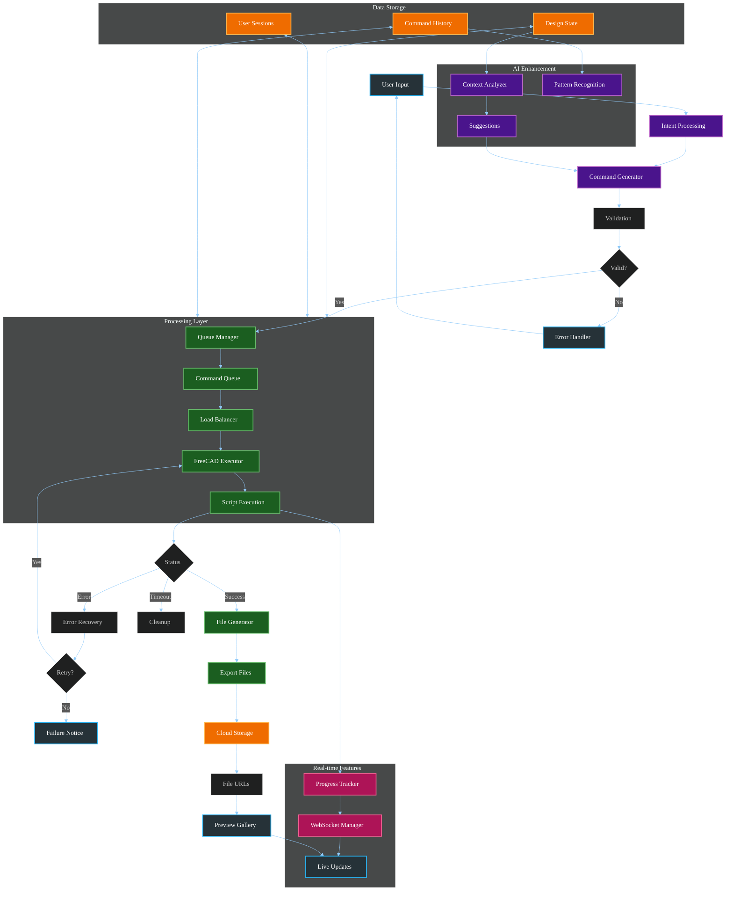

```mermaid 
%%{ init: { 
    "theme": "dark", 
    "themeVariables": {
        "primaryColor": "#1e88e5",
        "primaryTextColor": "#ffffff",
        "primaryBorderColor": "#90caf9",
        "lineColor": "#90caf9",
        "tertiaryColor": "#2c2c2c",
        "fontFamily": "Inter, sans-serif"
    } 
} }%%

graph TD
    A[User Input] --> B[Intent Processing]
    B --> C[Command Generator]
    C --> D[Validation]
    D --> E{Valid?}
    E -->|No| F[Error Handler]
    F --> A
    E -->|Yes| G[Queue Manager]
    
    subgraph Processing["Processing Layer"]
        G --> H[Command Queue]
        H --> I[Load Balancer]
        I --> J[FreeCAD Executor]
        J --> K[Script Execution]
    end
    
    subgraph Storage["Data Storage"]
        L[Design State]
        M[User Sessions]
        N[Command History]
    end
    
    K --> O{Status}
    O -->|Success| P[File Generator]
    O -->|Error| Q[Error Recovery]
    O -->|Timeout| R[Cleanup]
    
    Q --> S{Retry?}
    S -->|Yes| J
    S -->|No| T[Failure Notice]
    
    P --> U[Export Files]
    U --> V[Cloud Storage]
    V --> W[File URLs]
    
    subgraph Realtime["Real-time Features"]
        X[WebSocket Manager]
        Y[Progress Tracker]
        Z[Live Updates]
    end
    
    subgraph AI["AI Enhancement"]
        AA[Context Analyzer]
        BB[Pattern Recognition]
        CC[Suggestions]
    end
    
    K --> Y
    Y --> X
    X --> Z
    
    L --> AA
    N --> BB
    AA --> CC
    CC --> C
    
    L <--> Processing
    M <--> Processing
    N <--> Processing
    
    W --> DD[Preview Gallery]
    DD --> Z

    %% Styling
    classDef userLayer fill:#263238,stroke:#29b6f6,color:#ffffff,stroke-width:2px
    classDef aiLayer fill:#4a148c,stroke:#ba68c8,color:#ffffff,stroke-width:2px
    classDef executionLayer fill:#1b5e20,stroke:#66bb6a,color:#ffffff,stroke-width:2px
    classDef storageLayer fill:#ef6c00,stroke:#ffb74d,color:#ffffff,stroke-width:2px
    classDef realtimeLayer fill:#ad1457,stroke:#f06292,color:#ffffff,stroke-width:2px

    class A,F,T,Z,DD userLayer
    class B,C,AA,BB,CC aiLayer
    class G,H,I,J,K,P,U executionLayer
    class L,M,N,V storageLayer
    class X,Y realtimeLayer
```